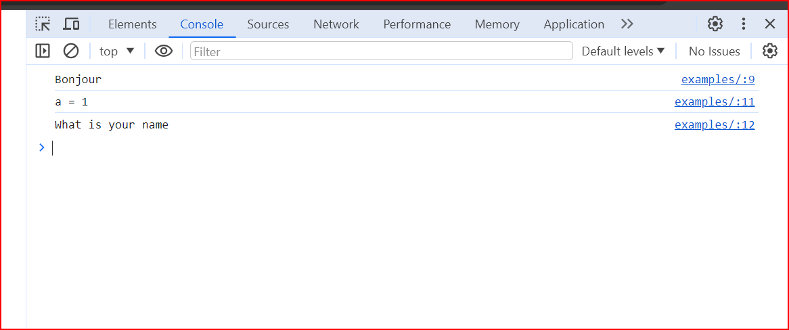

# cour 01 : **``Introduction``:**


## 1. **``JavaScript ?:``**


>JavaScript est un langage de programmation qui permet de créer des pages web interactives. Conçu à l'origine pour fonctionner dans les navigateurs web, JavaScript s'est imposé comme l'un des langages de programmation les plus populaires et polyvalents. 

- Il offre la possibilité d'ajouter des fonctionnalités dynamiques aux sites web, permettant aux développeurs de créer des expériences utilisateur plus riches et interactives. 

- En plus de son utilisation côté client pour améliorer l'interactivité des pages web, JavaScript est également utilisé côté serveur grâce à des plates-formes comme Node.js. 

- Sa syntaxe souple et son intégration transparente avec le HTML et le CSS en font un outil puissant pour le développement web. 


## 2. **setting up environment**

Pour travailler efficacement avec JavaScript dans Visual Studio Code (VSCode), il est recommandé d'installer certaines extensions qui facilitent le développement, la débogage et l'amélioration de la productivité. Voici quelques extensions utiles :

1. **ESLint :** Pour la détection et la correction des erreurs de style dans le code JavaScript.

2. **Prettier - Code formatter :** Assure une mise en forme cohérente du code conformément aux conventions établies.

3. **Debugger for Chrome :** Permet de déboguer les applications JavaScript directement dans le navigateur Google Chrome.

4. **npm :** Fournit une intégration avec npm (Node Package Manager) pour la gestion des dépendances dans vos projets JavaScript.

5. **JavaScript (ES6) code snippets :** Ajoute des snippets de code pour faciliter l'écriture de code JavaScript ES6.

6. **Auto Import :** Simplifie l'importation de modules et de packages en proposant automatiquement des suggestions.

7. **Path Intellisense :** Facilite la saisie des chemins de fichiers en proposant des suggestions en temps réel.

8. **Bracket Pair Colorizer :** Aide à visualiser les paires de parenthèses, crochets et accolades en les colorant de manière distincte.

9. **Live Server :** Permet de créer un serveur local pour le développement et prend en charge le rechargement automatique du navigateur.

10. **GitLens :** Améliore l'intégration de Git dans VSCode, offrant une visibilité accrue sur l'historique du code et les changements.

 
## 3. **Relier un fichier JavaScript à un fichier HTML:**

Pour relier un fichier JavaScript à un fichier HTML, vous avez plusieurs façons de le faire. 

1. **Balise `<script>` dans le `<head>` :**

   Ajoutez la balise `<script>` dans la section `<head>` de votre fichier HTML pour charger votre fichier JavaScript. Par exemple :

   ```html
   <!DOCTYPE html>
   <html lang="en">
   <head>
       <meta charset="UTF-8">
       <meta name="viewport" content="width=device-width, initial-scale=1.0">
       <title>Mon Site Web</title>
       <script src="chemin/vers/votre-fichier.js"></script>
   </head>
   <body>
       <!-- Le contenu de votre page va ici -->
   </body>
   </html>
   ```

2. **Balise `<script>` à la fin du `<body>` :**

   Une autre approche consiste à placer la balise `<script>` juste avant la fermeture de la balise `</body>`. Cela peut améliorer les performances de chargement de la page en permettant au reste de la page de se charger avant le script. Par exemple :

   ```html
   <!DOCTYPE html>
   <html lang="en">
   <head>
       <meta charset="UTF-8">
       <meta name="viewport" content="width=device-width, initial-scale=1.0">
       <title>Mon Site Web</title>
   </head>
   <body>
       <!-- Le contenu de votre page va ici -->

       <script src="chemin/vers/votre-fichier.js"></script>
   </body>
   </html>
   ```

#### RQ :

-  Il est recommandé de placer la balise `<script>` toujours juste avant la fermeture de la balise `</body>`.

## 4. **Google Chrome Developer Tools (DevTools)**

Google Chrome Developer Tools (DevTools) est un ensemble d'outils intégrés dans le navigateur web Google Chrome qui facilite le développement, le débogage et le profilage des applications web. Voici comment utiliser Chrome DevTools pour le développement JavaScript :

1. **Ouvrir Chrome DevTools :**
   - Cliquez droit sur votre page web dans Chrome.
   - Sélectionnez "Inspecter" dans le menu contextuel.
   - Ou appuyez sur `Ctrl+Shift+I` (Windows/Linux) ou `Cmd+Opt+I` (Mac).

2. **Onglet "Console" :**
   - L'onglet "``Console``" vous permet d'interagir avec la console JavaScript. Vous pouvez saisir du code JavaScript directement et voir les résultats.

3. **Débogage JavaScript :**
   - Allez à l'onglet ``Sources`` pour déboguer votre code JavaScript.
   - Chargez votre page et recherchez votre fichier JavaScript dans le panneau de gauche.
   - Ajoutez des points d'arrêt en cliquant à gauche du numéro de ligne.
   - Actualisez votre page pour déclencher le débogueur.

4. **Profiling :**
   - Utilisez l'onglet "``Performance``" pour profiler les performances de votre application.
   - Enregistrez un profil, effectuez des interactions sur votre page, puis arrêtez l'enregistrement pour analyser les résultats.

5. **Network Panel :**
   - L'onglet "``Network``" permet de surveiller les requêtes réseau, y compris les requêtes AJAX et les chargements de fichiers.

6. **Application Panel :**
   - L'onglet "``Application``" offre des informations sur les données stockées localement, les caches, les cookies, etc.

7. **Memory Panel :**
   - L'onglet "``Memory``" vous permet de surveiller l'utilisation de la mémoire par votre application.

8. **Security Panel :**
   - L'onglet "``Security``" fournit des informations sur la sécurité de votre site, notamment les certificats SSL.

9. **Console API :**
   - Utilisez la console pour afficher les résultats de vos commandes. Par exemple, utilisez `console.log()` pour afficher des messages de débogage.

Ces fonctionnalités de DevTools offrent un ensemble complet d'outils pour le développement JavaScript et la détection des problèmes potentiels dans vos applications web.





## 5. **Les commentaires:**

En JavaScript, il existe deux façons de créer des commentaires :

1. **Commentaires sur une ligne :**
   Utilisez `//` pour créer un commentaire sur une seule ligne.

   ```javascript
   // Ceci est un commentaire sur une seule ligne
   let variable = 42;  // Un autre commentaire à la fin de la ligne
   ```

2. **Commentaires sur plusieurs lignes :**
   Utilisez `/*` pour ouvrir un commentaire sur plusieurs lignes et `*/` pour le fermer.

   ```javascript
   /*
      Ceci est un commentaire
      sur plusieurs lignes.
   */
   let autreVariable = "Hello, World!";
   ```

Les commentaires sont ignorés lors de l'exécution du code et ne sont utilisés que pour fournir des explications, des notes ou désactiver temporairement des portions de code.

Il est recommandé d'utiliser des commentaires pour documenter votre code, expliquer des parties complexes, ou pour laisser des messages pour d'autres développeurs (ou même pour vous-même dans le futur). Cela améliore la lisibilité et la compréhension du code.