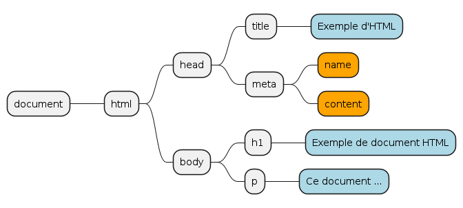

# cour 17 **`DOM`:**

## 1. **Introduction**

- **Définition:**

  > Le Document Object Model (DOM) est un concept fondamental dans le développement web. Il s'agit d'une interface de programmation qui permet aux développeurs web d'interagir avec la structure, le style et le contenu d'une page web. Le DOM représente la page web sous forme d'un arbre hiérarchique où chaque élément de la page, comme les balises HTML, les attributs et le texte, est représenté comme un nœud dans cet arbre.



## 2. **l'objet `document`:**

- **Description:**

  > L'objet `document` représente le modèle DOM pour l'ensemble de la page web. Il fournit des méthodes et des propriétés permettant de manipuler et d'accéder aux éléments et au contenu de la page web.

- **attributs de l'objet `document` :**

  - `document.body` : Cette propriété renvoie le noeud du corps de la page HTML.

  - `document.head` : Cette propriété renvoie le noeud de l'en-tête de la page HTML.

  - `document.links` : Cette propriété renvoie une collection d'éléments `<a>` qui représentent les liens hypertexte de la page.

  - `document.forms` : Cette propriété renvoie une collection d'éléments `<form>` qui représentent les formulaires de la page. Chaque élément de cette collection correspond à un formulaire sur la page.

  - `document.images` : Cette propriété renvoie une collection d'éléments `` qui représentent les images de la page. Chaque élément de cette collection correspond à une image sur la page.

  - `document.title` : Cette propriété renvoie le titre du document.

- **Exemple d'utilisation :**

  ```html
  <!DOCTYPE html>
  <html lang="en">
    <head>
      <meta charset="UTF-8" />
      <meta name="viewport" content="width=device-width, initial-scale=1.0" />
      <title>Document Object Model</title>
    </head>
    <body>
      <span class="my-span">My span</span>
      <p>Hello Paragraphe 1</p>
      <p>Hello Paragraphe 2</p>
      <div id="my-id">
        <form action="">
          <input type="text" name="one" value="Hello" />
        </form>
        <form action="">
          <input type="text" name="two" value="Hello" />
        </form>
        <a href="https://google.com">Google</a>
        <a href="https://facebook.com">facebook</a>
      </div>
      <script>
        console.log(document.title);
        console.log(document.body);
        console.log(document.forms);
        console.log(document.links);
        console.log(document.images);
        console.log(document.links[1].href);
      </script>
    </body>
  </html>
  ```

## 3. **`accéder à un élément HTML`:**

1. **getElementById** :

   - **Description** : Cette méthode permet de récupérer un élément du DOM en fonction de son ID unique.
   - **Syntaxe** : `document.getElementById(id)`
   - **Type de retour** : Retourne l'élément correspondant ou `null` s'il n'est pas trouvé.
   - **Exemple** :
     ```javascript
     var element = document.getElementById("myElement");
     ```

2. **getElementsByTagName** :

   - **Description** : Cette méthode récupère une liste d'éléments du DOM en fonction de leur nom de balise.
   - **Syntaxe** : `document.getElementsByTagName(tagName)`
   - **Type de retour** : Retourne une liste d'éléments correspondants sous forme de NodeList.
   - **Exemple** :
     ```javascript
     var paragraphs = document.getElementsByTagName("p");
     ```

3. **getElementsByClassName** :

   - **Description** : Cette méthode récupère une liste d'éléments du DOM en fonction de leur classe.
   - **Syntaxe** : `document.getElementsByClassName(className)`
   - **Type de retour** : Retourne une liste d'éléments correspondants sous forme de NodeList.
   - **Exemple** :
     ```javascript
     var elements = document.getElementsByClassName("myClass");
     ```

4. **querySelector** :

   - **Description** : Cette méthode récupère le premier élément du DOM correspondant au sélecteur CSS spécifié.
   - **Syntaxe** : `document.querySelector(selectors)`
   - **Type de retour** : Retourne le premier élément correspondant ou `null` s'il n'est pas trouvé.
   - **Exemple** :
     ```javascript
     var element = document.querySelector(".myClass");
     ```

5. **querySelectorAll** :
   - **Description** : Cette méthode récupère tous les éléments du DOM correspondant au sélecteur CSS spécifié.
   - **Syntaxe** : `document.querySelectorAll(selectors)`
   - **Type de retour** : Retourne tous les éléments correspondants sous forme de NodeList.
   - **Exemple** :
     ```javascript
     var elements = document.querySelectorAll("p.myClass");
     ```

## 4. **``:**
