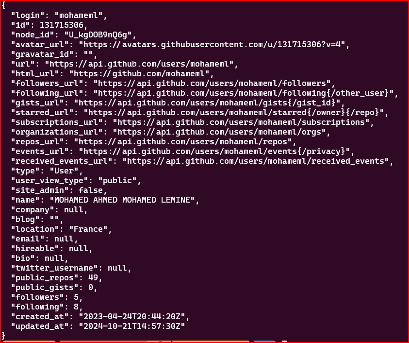

# cour 38 : **API**

## 1. **Introduction:**

-   **Définition d'une API**

    -   Une **API** (Application Programming Interface) est un ensemble de règles et de spécifications qui permet à des applications ou systèmes informatiques différents de communiquer entre eux. Elle définit les méthodes, les requêtes et les formats de données que les applications peuvent utiliser pour interagir de manière cohérente et prévisible.

    -   En d'autres termes, une API est un "contrat" qui spécifie comment un logiciel ou un service peut être utilisé par d'autres logiciels. Elle permet de simplifier et d’abstraire des processus complexes, tout en offrant des points d'accès standardisés pour interagir avec une fonctionnalité ou des données.

    -   Les API sont essentielles dans le développement moderne, permettant aux applications de :

        -   **Échanger des données** entre des systèmes différents.
        -   **Accéder à des services externes** (par exemple, services de géolocalisation, paiement, etc.).

-   **Types d'API**

    1. **API Web** :

        - Permet de communiquer avec des serveurs distants via des protocoles web comme HTTP ou HTTPS.
        - Exemple : les API RESTful et GraphQL qui permettent aux clients (comme un navigateur ou une application mobile) de récupérer des données depuis un serveur.

    2. **API de bibliothèque/logiciel** :

        - Permet d'utiliser des fonctionnalités d'une bibliothèque ou d'un framework sans avoir à connaître l'implémentation interne.
        - Exemple : L'API de la bibliothèque `React` pour la création d'interfaces utilisateur.

    3. **API système** :

        - Permet de communiquer avec des composants d'un système d'exploitation.
        - Exemple : les API de Windows, Linux, ou macOS pour interagir avec des ressources comme les fichiers, les processus, ou les périphériques.

    4. **API de base de données** :
        - Permet d'interagir avec une base de données à travers des requêtes standardisées.
        - Exemple : SQL ou API NoSQL comme MongoDB.

-   **Exemple 1: d'API Web (RESTful)**

    Les API Web sont parmi les plus courantes aujourd'hui, notamment les API **REST** (Representational State Transfer). Une API REST permet de manipuler des ressources (comme des données) en utilisant des méthodes HTTP standards (GET, POST, PUT, DELETE).

    Exemple : API REST pour gérer des utilisateurs

    -   **GET** `/users` : Récupérer une liste de tous les utilisateurs.
    -   **GET** `/users/{id}` : Récupérer un utilisateur spécifique par son identifiant.
    -   **POST** `/users` : Créer un nouvel utilisateur.
    -   **PUT** `/users/{id}` : Mettre à jour les informations d'un utilisateur existant.
    -   **DELETE** `/users/{id}` : Supprimer un utilisateur.

-   **Exemple 2 : API github**

    ```bash
    curl https://api.github.com/users/mohameml
    // ou
    GET https://api.github.com/users/mohameml

    ```

    
