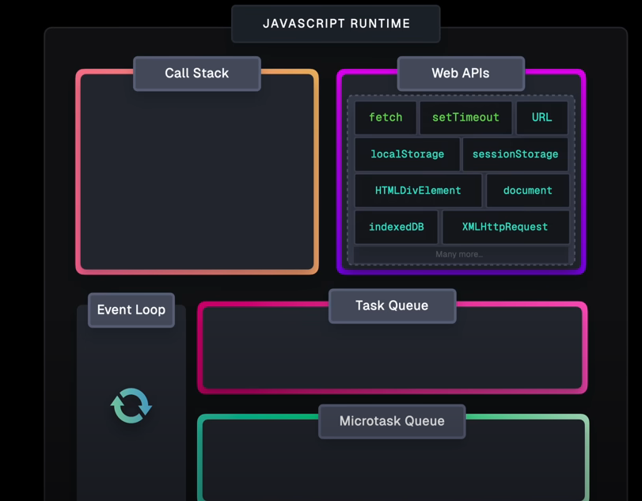

# cour 39 :**Asynchronous vs Synchronous Programming:**

## 1. **Introduction:**

> En programmation JavaScript, les termes **synchrone** et **asynchrone** décrivent comment le code est exécuté et comment les opérations d'entrée-sortie (comme les requêtes réseau, la lecture de fichiers, etc.) sont gérées.

### 1.1 **Programmation synchrone** :

-   **Description:**

    > La programmation synchrone suit un flux d'exécution linéaire où chaque opération est exécutée une à une, dans l'ordre où elles apparaissent dans le code. Cela signifie que le programme attend la fin d'une opération avant de passer à la suivante.

-   **Caractéristiques :**

    -   **Blocage** : Lorsqu'une opération est en cours, le programme attend qu'elle se termine avant de continuer.
    -   **Simplicité** : Le flux de contrôle est simple et facile à comprendre, mais peut poser des problèmes de performance lorsqu'il y a des opérations lentes (comme des requêtes réseau ou des lectures de fichiers).

-   **Exemple :**

    ```javascript
    console.log("Début");
    console.log("Milieu");
    console.log("Fin");
    ```

    Dans cet exemple, le programme affiche successivement "Début", "Milieu", puis "Fin", sans aucune interruption.

### 1.2.**Programmation asynchrone** :

-   **Description:**

    > La programmation asynchrone permet au programme de continuer à s'exécuter sans attendre que certaines opérations se terminent. Elle est particulièrement utile pour les opérations longues, comme la lecture de fichiers ou les requêtes HTTP, qui peuvent être effectuées en arrière-plan pendant que le programme poursuit son exécution.

-   **Caractéristiques :**

    -   **Non-bloquant** : Le programme peut continuer à s'exécuter même si une opération est en attente de finition.

    -   **Gestion des callbacks, Promises et async/await** : Les mécanismes comme les **callbacks**, les **Promesses** et `async/await` sont utilisés pour gérer les opérations asynchrones et éviter les blocages.
        -   **Callbacks** : Fonctions passées en argument qui sont exécutées une fois l'opération terminée.
        -   **Promises** : Représentation de valeurs qui peuvent ne pas être disponibles immédiatement, mais le seront à l'avenir.
        -   **async/await** : Une manière plus simple d'écrire du code asynchrone, qui ressemble à du code synchrone tout en restant asynchrone.

-   **Exemple :**

    ```javascript
    console.log("Début");

    setTimeout(() => {
        console.log("Milieu");
    }, 2000);

    console.log("Fin");
    ```

    Dans cet exemple, "Début" est affiché, puis le code continue d'exécuter "Fin" immédiatement, tandis que "Milieu" est affiché après un délai de 2 secondes (grâce à `setTimeout`). Le programme n'attend pas que `setTimeout` termine avant de passer à la ligne suivante.

## 2. **Call Stack:**

-   **Introduction :**

    > Le **call stack** (pile d'appel) est une structure de données utilisée par le moteur JavaScript pour gérer l'exécution des fonctions. Elle suit le principe **LIFO (Last In, First Out)**, ce qui signifie que la dernière fonction ajoutée au stack sera la première à être exécutée. Le call stack garde la trace de l'ordre d'exécution des fonctions et des appels de fonctions imbriquées.

    -   Lorsqu'une fonction est appelée, elle est ajoutée au sommet de la pile. Une fois que cette fonction a terminé son exécution, elle est retirée du stack, et le moteur JavaScript reprend l'exécution de la fonction qui l'a appelée.

-   **Exemple simple de call stack :**

    ```javascript
    function one() {
        console.log("1");
    }

    function two() {
        one();
        console.log("2");
    }

    function three() {
        two();
        console.log("3");
    }

    three();
    ```

    Étapes d'exécution :

    -   `three()` est appelée, elle entre dans le call stack.
    -   `three()` appelle `two()`, donc `two()` est ajoutée au call stack au-dessus de `three()`.
    -   `two()` appelle `one()`, donc `one()` est ajoutée au call stack au-dessus de `two()`.
    -   `one()` termine son exécution et est retirée du stack.
    -   `two()` termine son exécution et est retirée du stack.
    -   Enfin, `three()` termine son exécution et est retirée du stack.

-   **Le cas des `fonctions asynchrones` :**

    Lorsqu'une fonction **asynchrone** est appelée, par exemple une fonction qui utilise un `setTimeout`, une **promise** ou une opération réseau, elle n'est pas immédiatement exécutée dans le call stack. À la place, elle est ajoutée à un autre mécanisme appelé **event loop** ou **message queue**. Voici le déroulement :

    -   La fonction asynchrone (par exemple, une fonction avec `setTimeout`) est lancée et entre dans le call stack.
    -   Elle est immédiatement retirée du stack après avoir été appelée, car elle contient une opération asynchrone.
    -   L'opération asynchrone est ensuite placée dans la **message queue** après que le délai ou l'événement soit terminé.
    -   Une fois que le call stack est vide (c'est-à-dire que toutes les fonctions synchrones ont été exécutées), l'event loop prend les fonctions de la message queue et les place dans le call stack pour qu'elles soient exécutées.

-   **Exemple avec une fonction asynchrone :**

    ```javascript
    console.log("Début");

    setTimeout(() => {
        console.log("C'est asynchrone");
    }, 1000);

    console.log("Fin");
    ```

    Étapes d'exécution :

    -   `"Début"` est affiché immédiatement.
    -   `setTimeout` est exécuté et la fonction de callback est placée dans l'event loop pour être exécutée après 1000ms.
    -   `"Fin"` est affiché immédiatement après.
    -   Après 1000ms, la fonction de callback du `setTimeout` est déplacée dans le call stack, où elle est exécutée, et `"C'est asynchrone"` est affiché.

## 3. **Callback , Task Queue & Event Loop:**

-   **Callback**

    -   Un **callback** est une fonction qui est passée en argument à une autre fonction pour être appelée (ou exécutée) plus tard, une fois que l'opération asynchrone ou spécifique est terminée.

    -   Un callback permet de gérer l'asynchronisme en JavaScript.

    -   Il est exécuté seulement lorsque la tâche en cours est terminée (comme lire un fichier, attendre une requête HTTP, etc.).

    -   Dans le contexte asynchrone, un callback est souvent utilisé avec des opérations comme `setTimeout`, des requêtes réseau, ou des lectures de fichiers :

        ```javascript
        console.log("1. Avant l'opération asynchrone");

        setTimeout(() => {
            console.log(
                "2. Cette ligne est exécutée après 2 secondes (callback)"
            );
        }, 2000);

        console.log("3. Après avoir démarré l'opération asynchrone");
        ```

-   **Event Loop**

    -   L'**Event Loop** (boucle d'événements) est un mécanisme fondamental en JavaScript qui gère l'exécution du code, la collecte et le traitement des événements, et l'exécution des tâches différées (comme les callbacks ou les promesses).

    -   **Fonctionnement :**

        -   JavaScript est **monothread**, ce qui signifie qu'il exécute une tâche à la fois.
        -   Pour gérer les tâches asynchrones, il utilise une file d'attente (task queue) et l'event loop.

        L'event loop fonctionne comme suit :

        1. JavaScript exécute le code synchrone, ligne par ligne (pile d'appels, ou **call stack**).
        2. Les tâches asynchrones (comme `setTimeout`) sont envoyées à une file d'attente (task queue ou microtask queue pour les promesses).
        3. Une fois que la pile d'appels est vide, l'event loop récupère les tâches de la file d'attente et les exécute.

-   **Task Queue:**

    -   La **Task Queue** est une structure de données qui contient des tâches asynchrones prêtes à être exécutées. Ces tâches sont généralement des callbacks issus d'API Web, comme `setTimeout`, `setInterval`, ou des événements comme un clic de souris ou une requête réseau.

    -   **Fonctionnement Étape par Étape :**

        1. Une opération asynchrone est déclenchée (par exemple, un `setTimeout`).
        2. Le moteur JavaScript continue d'exécuter le code synchrone pendant que l'opération asynchrone est en cours.
        3. Une fois l'opération terminée (par exemple, le délai du `setTimeout` est écoulé), le callback correspondant est placé dans la **Task Queue**.
        4. Lorsque la **Call Stack** est vide, l'**Event Loop** extrait les tâches de la Task Queue et les exécute, une par une.



### RQ : **Video:**

[youtube](https://youtu.be/eiC58R16hb8?si=0owYCHVWa1fa4_f-)
